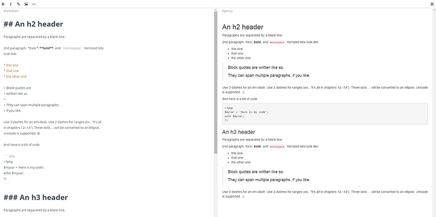

# WIPBICTBF : Work in progress but it's close to be finished



[DEMO](http://rawgit.com/Grafikart/JS-Markdown-Editor/master/dist/demo.html)

## How it works

To transform a textarea in an markdown editor you just have to create a new MdEditor instance
```javascript
var md = new MdEditor('#mdeditor');
```
You can pass options ass the second parameter

```javascript
var md = new MdEditor('#mdeditor', {
uploader: false, //'http://local.dev/Lab/MdEditor/app/upload.php?id=',
preview: true,
images: [
  {id: '1.jpg', url: 'http://lorempicsum.com/futurama/200/200/1'},
]
});
```

## Options

I created options for my needs, if you have some new ideas, PR are welcomed.

* **labelClose**  *'Do you really want to close this window ? Every edit you did could be lost'*
* **labelInsert**: *'Insert'*, This label is used within the image uploader
* **labelDelete**: *'Delete'*, 
* **labelSuccess**: *'Content saved with success'*, This label is used when saving using ctrl + s
* **labelImage**: *'Insert your image url'*, This label is used within the image uploader is not availabled
* **labelConfirm**: *'Do you really want to delete this picture ?'*
* **preview**: *true*, Enable the preview for the inline editor (preview is always displayed when fullscreen is enabled
* **uploader**: *false*, false to disable the image uploader (using drag'n drop) or a string containing the REST api endpoint
* **uploaderData**: *{}*, additional data to send when uploading (CSRF token for instance
* **ctrls**: *true*, enable autosaving, it will submit the form using ajax (so if you have additional fields, they will be sent too)
* **images**: *[]*, an array containing initial images to display within the image uploader
* **imageURL**: function(){ return el.url }, how to fetch the image URL from the image data
* **flash**: function(message, type) {return window.alert(message) }, a function that display error or success message. you can replace it using jgrowl or a notification system of your choice.

## Contributing

Before you can start you have to download you have to install npm dependencies, bower dependencies, then start gulp serve task

- npm install 
- bower install
- gulp serve

Then you can edit app/scripts/mdeditor.coffee to do some edits.

## Todo

- Rework the gulpfile.js
- Test it on multiple browsers (only tested with chrome atm)
